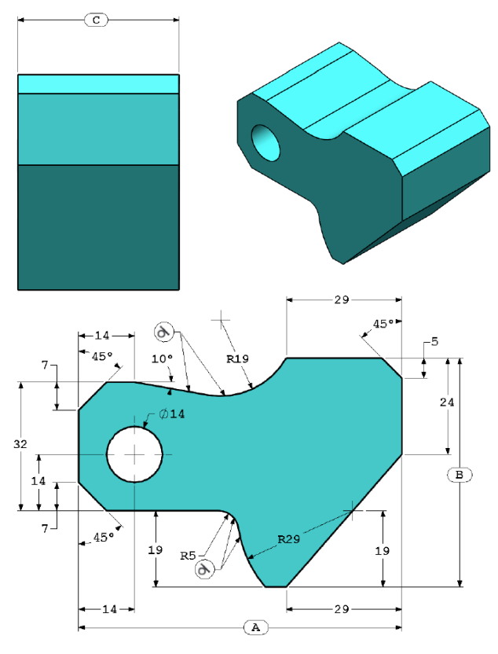
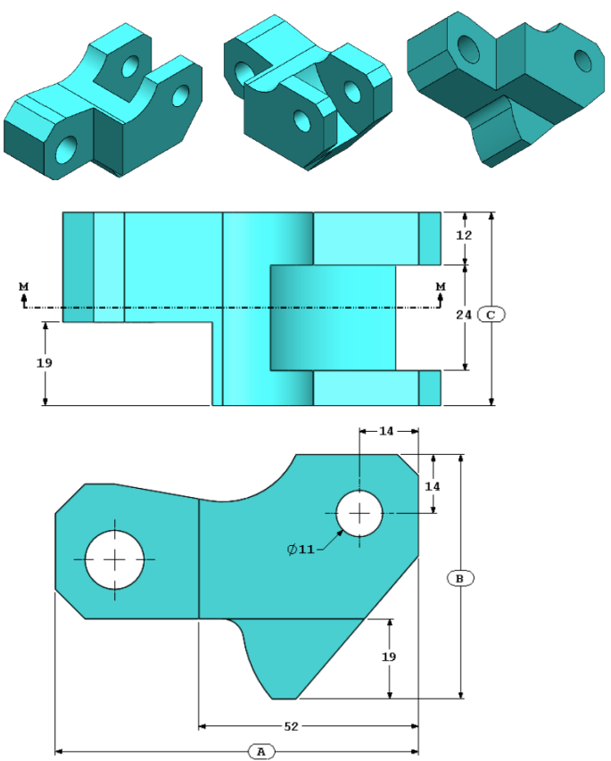
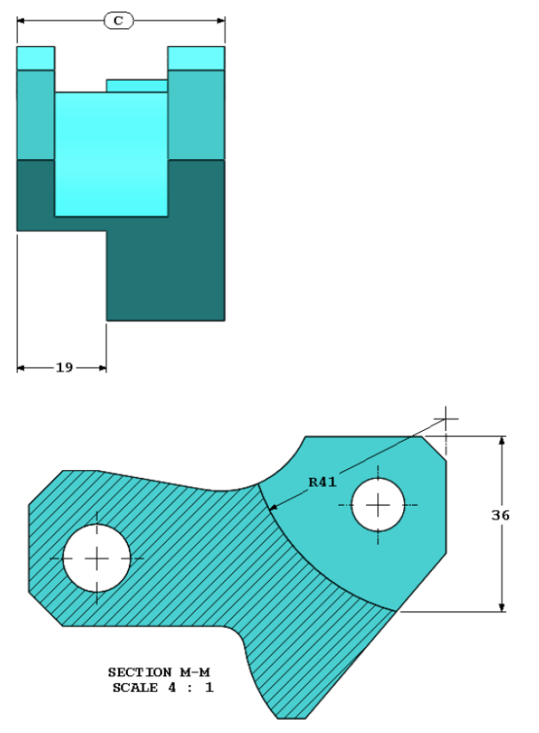
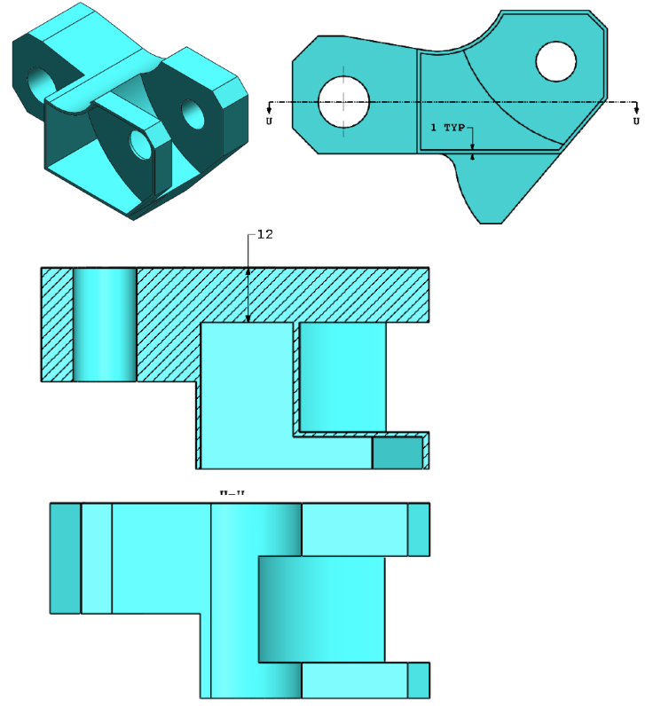

# Examen de Diseño Asistido por Computador (CAD)  

---

## **Instrucciones generales**  
1. Utilizar un software CAD para modelar la pieza.  
2. Aplicar las dimensiones calculadas con la suma de los dígitos del código.  
3. Exportar el modelo en formato [Formato requerido: .SLDPRT]
4. Responder las preguntas en la sección de evaluación.  

---

## Ejercicio 1

Crear la pieza de la siguiente imagen en SolidWorks:

(Guarde la pieza después de cada pregunta en un archivo diferente en caso de que deba revisarla)
Sistema de unidades: MMGS (milímetro, gramo, segundo)
Cifras decimales: 2
Origen de la pieza: arbitrario
Todos los taladros son por todo, a menos que se muestre algo distinto.
Material: acero ASTM A36
Densidad = $7850	kg/m^3$
X = Suma de los digitos de su código 
A = 4X 
B = 2,5X 
C = 2X 
**Ejemplo.** 
código = 5562201 
X = 5+5+6+2+2+0+1 = 21 
A = 4(21) = 84
B = 2,5(21) = 52,5
C = 2(21) = 42 

¿Cuál es la masa total de la pieza (gramos)?

## Ejercicio 2 

Realice las modificaciones que se observan en la siguiente imagen:

¿Cuál es la masa total de la pieza (gramos)?

## Ejercicio 3

Realice las modificaciones que se observan en la siguiente imagen:

¿Cuál es la masa total de la pieza (gramos)?

## Ejercicio 4

Crear la pieza de la siguiente imagen en SolidWorks:

Material: acero ASTM A36
Densidad = $7850	kg/m^3$
¿Cuál es la masa total de la pieza (gramos)?

## Ejercicio 5

Crear la pieza de la siguiente imagen en SolidWorks:

Material: acero ASTM A36
Densidad = $7850	kg/m^3$
¿Cuál es la masa total de la pieza (gramos)?

---

## **Entrega**  
- Subir el archivo CAD en [plataforma eCampus].  
- Formatos aceptados: **.SLDPRT, .PDF (con capturas de los resultados)**  

---

📌 **Nota:** Cualquier inconsistencia en las dimensiones debe ser reportada al instructor antes de la entrega.  

---

**¡Buena suerte!** 🎯  
